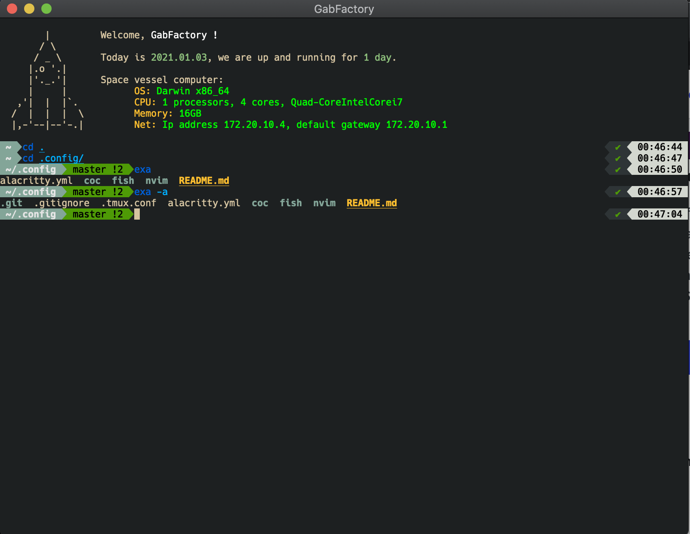
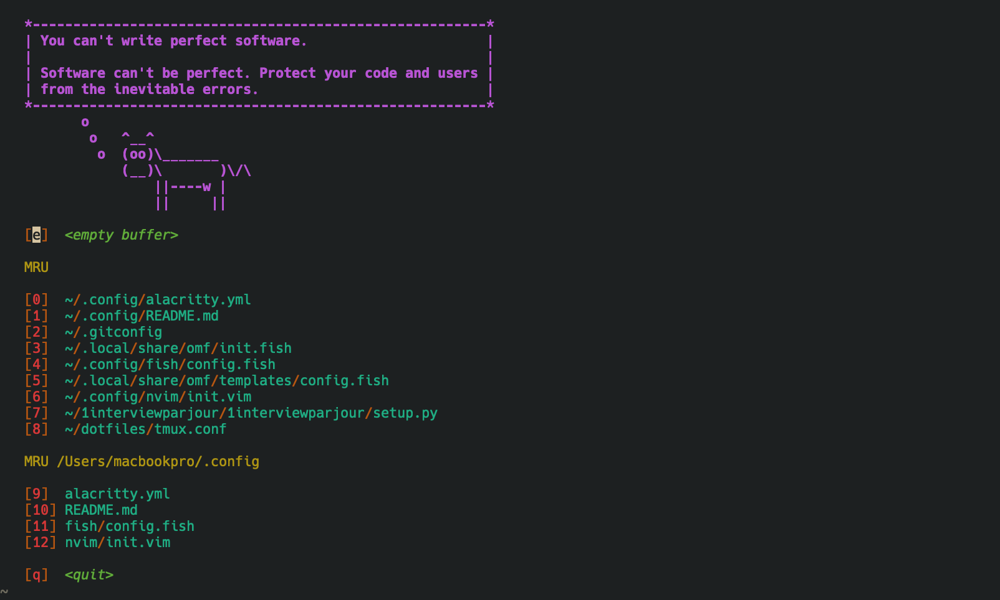

# Config

Fish + Alacritty + Base16 Theme

Neovim + Base16 Theme + many plugins (system programming semantic syntax hilighting) +  keymaps
This is my personal config. I use :

* Alacritty (GPU accelerated terminal emulator)
* Fish (modern shell)
* tmux (terminal mutliplexer)
* Neovim (editor)
