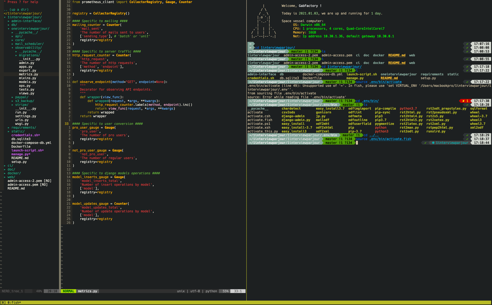

# Config

This is my personal config. I use :

* Alacritty (blazing fast GPU-accelerated terminal emulator written in pure Rust)
* Fish (modern shell)
* tmux (terminal mutliplexer)
* Neovim (editor) + my personnal plugins and hotkeys configurations
* Base16 atelier-dune colorscheme
